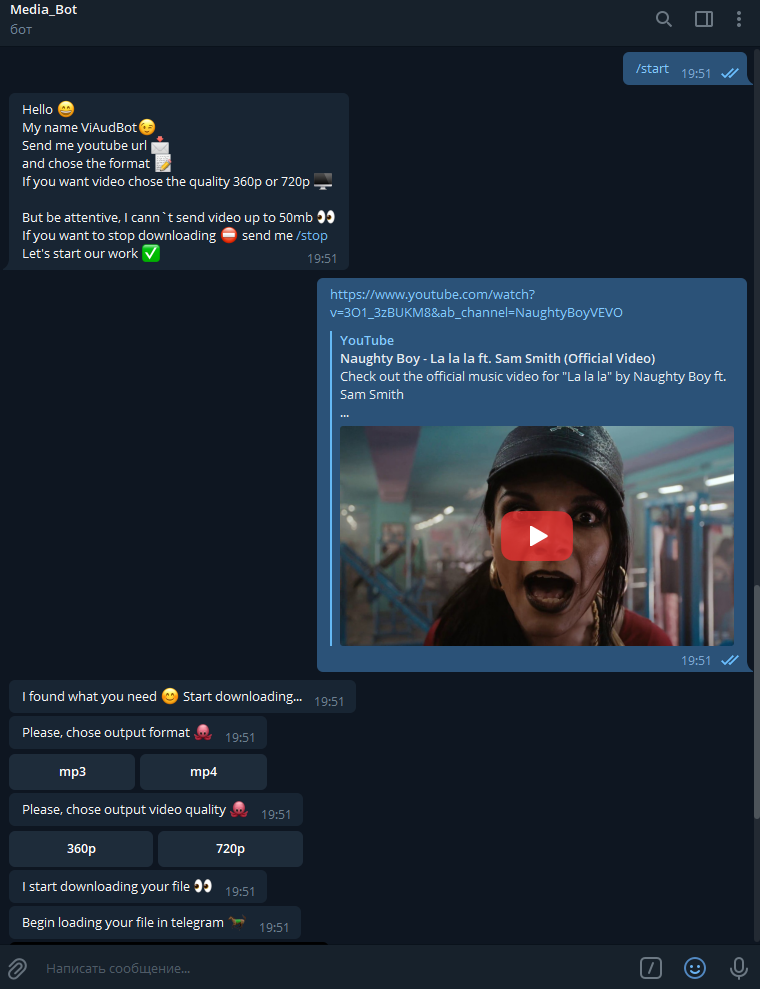
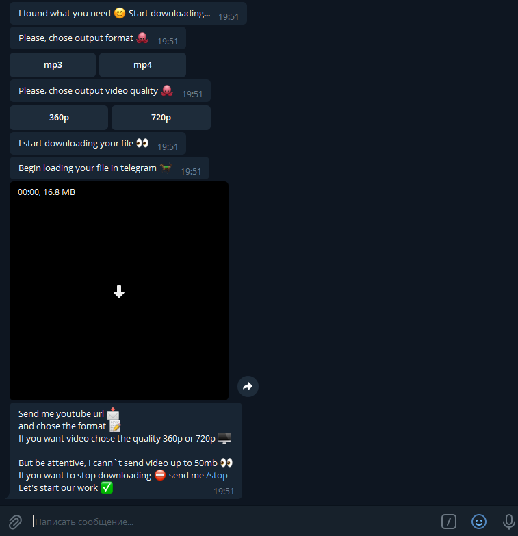
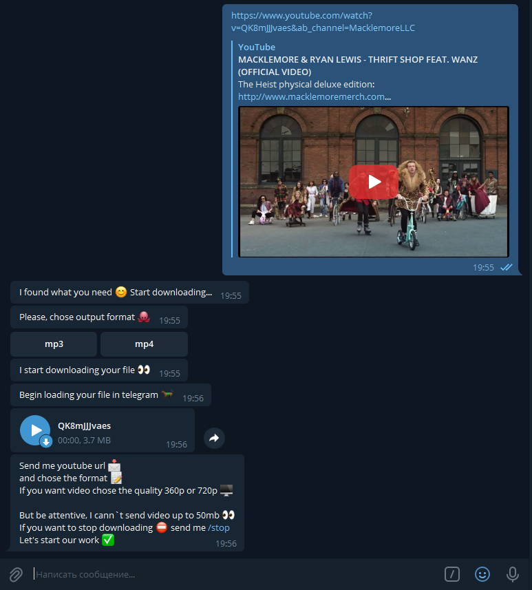

# YoutubeBot

Nowadays, major streaming platforms are increasingly degrading the quality of free use of their platform, and normal use of the platform is possible only with the purchase of a premium account. Therefore, I decided to create a telegram bot that would allow people to download video or audio files from the [Youtube](https://www.youtube.com/) streaming service and consume content offline. 

## Why is it useful?
- Request for unique YouTube content that cannot be found on other sites. Moreover, user can always have a choice whether to cache video or audio in telegram.

- Remixes of songs, for example, often, cannot be found via other Internet resources and exist only on YouTube. Also, on this service there are many popular science podcasts that can be converted to mp3 format and be able to listen, since the free version of the YouTube application does not allow for background video viewing.

## Bot API 
Conversation with bot will occur by exchanging messages, as follows:

## Database structure

The project will use the PostgreSQL database. The database will be used to save the state of the bot for each user and to save the unique identifiers of the uploaded files, so as not to download and convert, if necessary, unnecessarily, but to immediately send the file through this unique identifier.
Also, H2DB is used for testing in project.

## API
- Spring API
- Telegram Bot API
- Youtube-dl API
